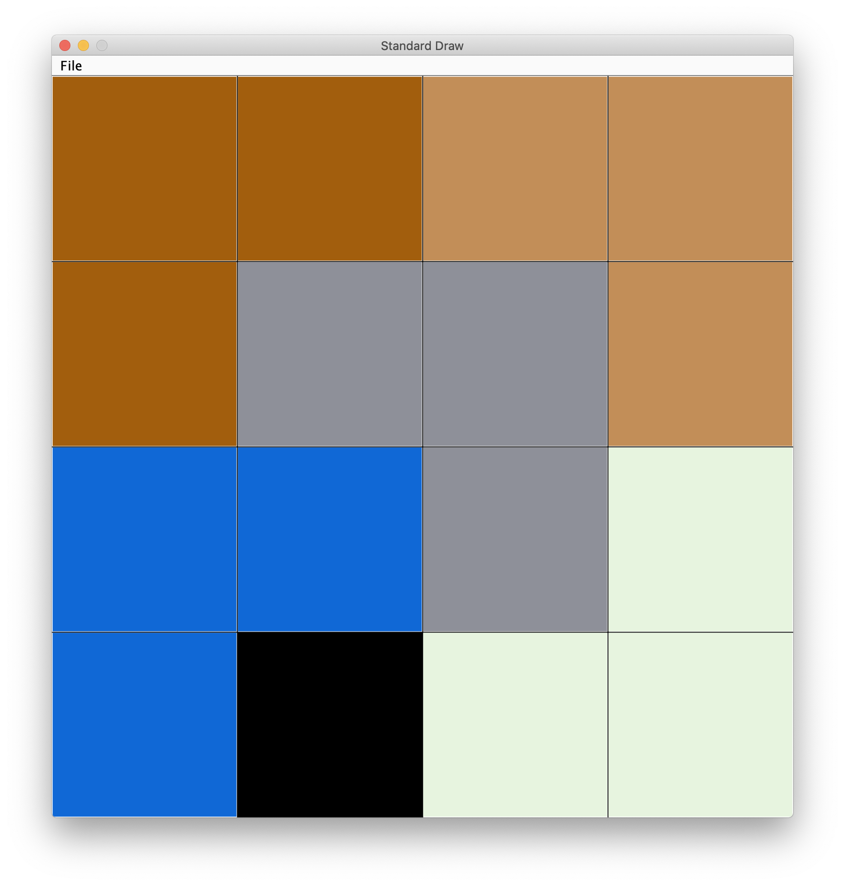
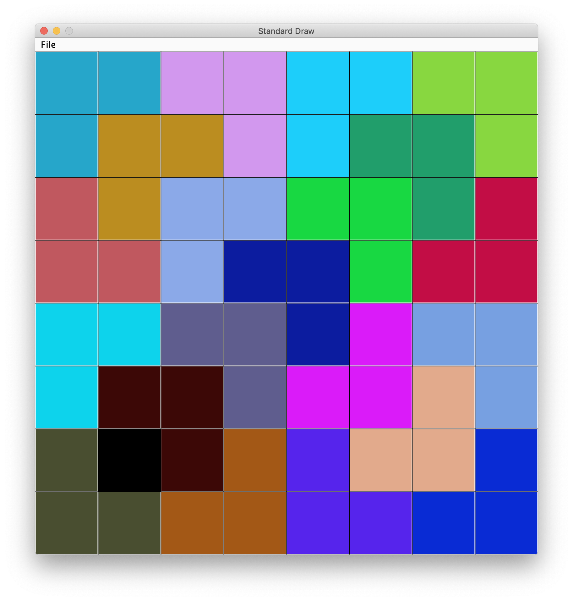
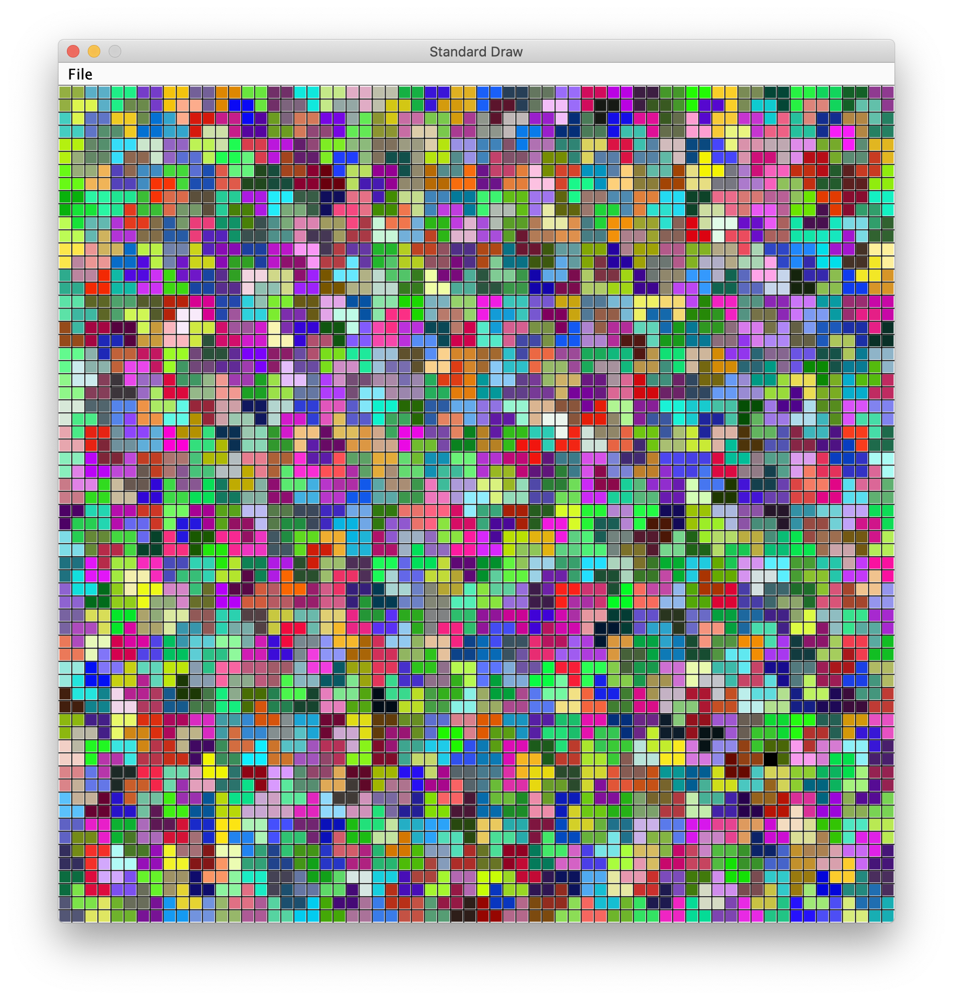
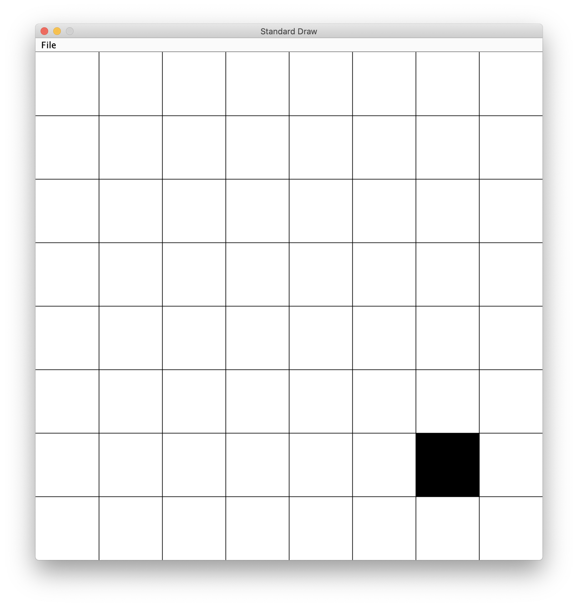
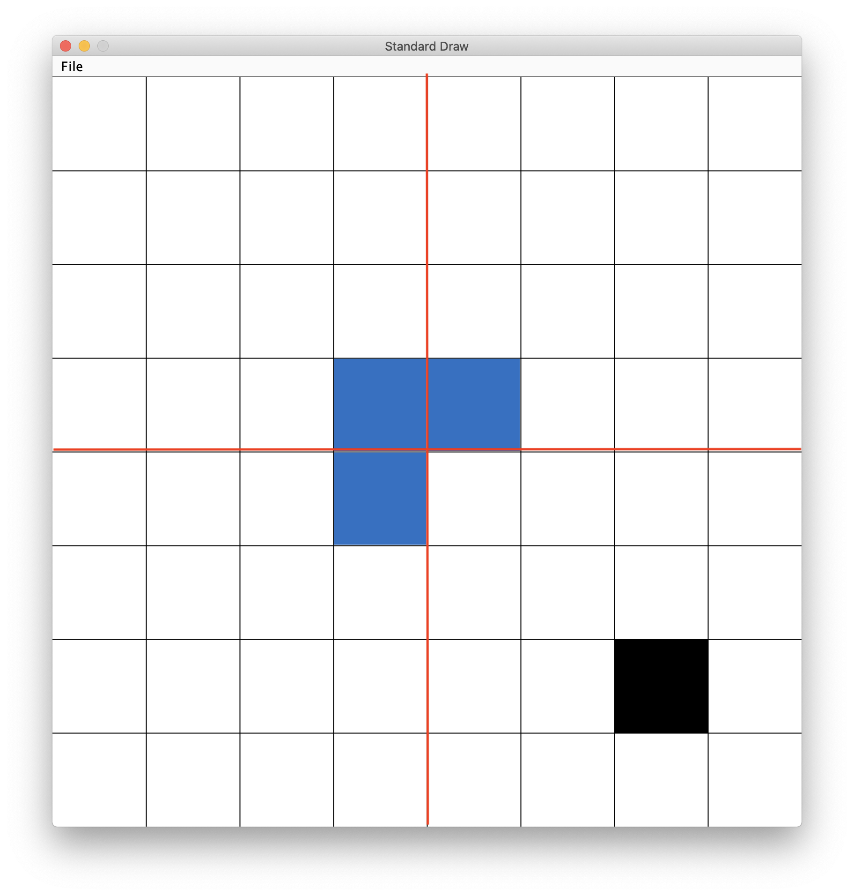
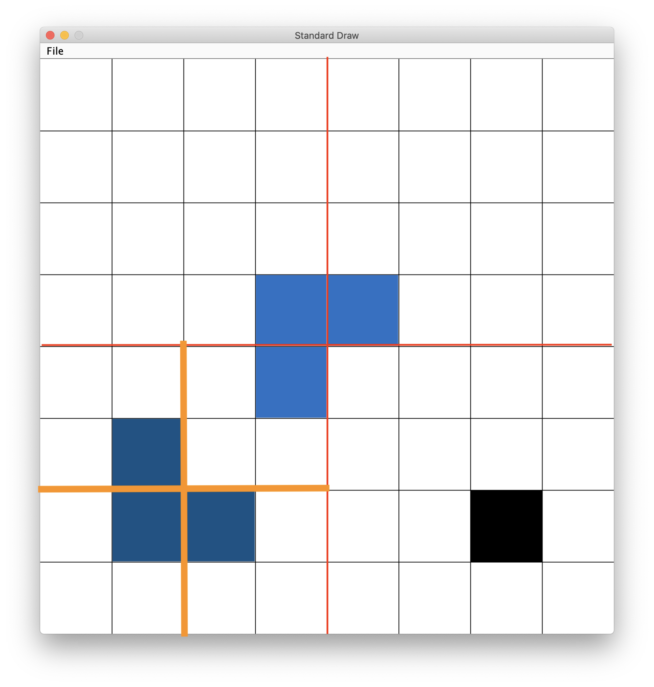
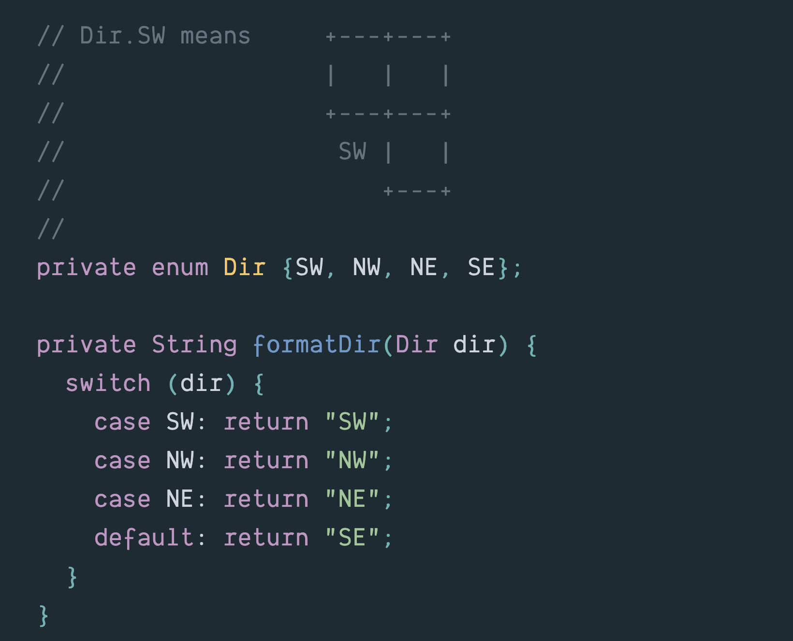

# CSCI 1102 Computer Science 2

### Spring 2021

##### Instructor R. Muller

---

## Problem Set 6 : Divide and Conquer Tiling

##### This is an optional pair problem set. You can work with a partner or work solo.

### 15 Points

### Due Monday March 29, 2021 Midnight

Consider the problem of laying out the floor of a square piazza with an artfully located fountain. For this problem, the area of the piazza can be viewed as a grid of dimensions 2x2, 4x4, 8x8, 16x16 etc. as long as the sides are a power of 2. We'll reserve a spot for the fountain with one black square tile placed at a randomly chosen row and column of the grid. It turns out that the rest of the piazza can be perfectly tiled with L-shaped tiles as shown below.

|           N = 2: 4 x 4            |           N = 3: 8 x 8            |           N = 6: 64 x 64           |
| :-------------------------------: | :-------------------------------: | :--------------------------------: |
|  |  |  |

Assume that you have an unlimited supply of randomly colored L-shaped tiles. An L-shaped tile takes up 3 square positions. In the 4x4 case on the left, there are 4 x 4 = 16 total positions. If we leave out the black tile marking the fountain at row=0, column=1, 15 positions remain, and these can be perfectly covered with 5 L-shaped tiles. In the middle there are 8 x 8 = 64 positions. Leaving out the black tile, 63 squares remain and these can be perfectly covered with 21 L-shaped tiles. On the right there are 64 x 64 = 4096 positions. Leaving out the (tiny) black tile, 4095 squares remain, and these can be perfectly covered with 1,365 L-shaped tiles.

### Divide and Conquer

Figuring out how to tile the piazza using just L-shaped tiles around a randomly chosen fountain position seems like a daunting task! But if we divide the problem in the right way, we can finish it off without too much fuss. **The key idea: divide the problem into subproblems that are like the given problem, but smaller.**

The image below left depicts a problem of size N = 3 (8 x 8 = 64 squares), with the square at row 1, column 6 randomly chosen for the fountain. The problem is to place 21 tiles on the 63 remaining squares. The middle diagram is bisected into 4 equal-size *quadrants* by red lines. Using "south" for down, "north" for up, "west" for left and "east" for right, we can see that the black tile occupies 1 of the 16 squares in the southeast quadrant, fifteen squares remain. *Placing one L-shaped tile around the northwest corner of the southeast quadrant, as shown in blue, restores balance between the quadrants: all have 15 spots remaining to tile.* We can finish tiling each of them with an appropriate recursive call.

Let's say we work clock-wise starting with the southwest quadrant, then solving the northwest quadrant, the northeast and finally the southeast quadrant. Each subproblem is of size N = 2 (4 x 4). In the figure on the right, the southwest quadrant is subdivided by orange lines into four sub-quadrants of size N = 1 (2 x 2). 

| Fountain has been randomly placed at row = 1 col = 6 | Placement of the L-shaped tile restores balance between quadrants |     Quadrant levels N=3, N=2 and N=1     |
| :--------------------------------------------------: | :----------------------------------------------------------: | :--------------------------------------: |
|              |                      |  |

The square at row 3 column 3 in the northeast sub-quadrant is covered with part of the lighter blue L-shaped tile laid down earlier. Three positions of that sub-quadrant remain to be tiled. We can again restore balance by placing an L-shaped tile around the southwest corner of that sub-quadrant as shown in darker blue and bisected by the orange lines. After placing this balancing tile, all 4 of the sub-quadrants represent the same problem, they each need exactly one balancing tile, for N = 1 (2 x 2), the base case of the recursion.

You can [see the algorithm](https://github.com/BC-CSCI1102/s21/blob/main/resources/tiling.md) in action.

#### What's Required

Create a Java program in a file named `Tiling.java`. Your program should accept an integer N as a command-line argument and use the algs4 `StdDraw` library to display the above-described tiling for a piazza of dimensions 2^N x 2^N. The canvas should be 800 x 800 pixels. (See `StdDraw.setCanvasSize`.) For example, running the program as in

```bash
> javac-algs4 Tiling.java
> java-algs4 Tiling 3
```

should render a perfect 8 x 8 tiling. All tiles other than the black square should be randomly colored and  L-shaped, there should be no open spots and no tile should hang off the side.

### Hints

This problem is challenging but I invite you to strike out on your own, ignoring most hints. If you feel that you need an assist, feel free to read the various hints below.

#### Working with `enums`

One hint that I'd like to share with all, is the utility of Java's `enum` form for working with directions. The harness code includes the snippet of code below. (Feel free to delete it if you like.) The `enum` form in this example introduces 4 symbolic constants `Dir.SW`, `Dir.NW`, `Dir.NE` and `Dir.SE`. Note the use of `Dir` as the *type* of the parameter for the `formatDir` function and note the use of Java's `switch` statement to branch on the direction. 

> Heads up: The code to the right of the colon `:` in a `case` for a `switch` statement will execute line by line, *and fall through to the code for the next case*. (!) Including a `break` statement as the last statement in the code for a case avoids this "falling through" behavior.




<details><summary>Hints on Getting Started</summary>
  Start simple. Parse the integer command line argument N (See Integer.parseInt). Given N, you can compute the grid size 2^N. Once you know the size of the grid, you can compute the size of a square block. If the grid is 2 x 2, then each block is of size 0.5 x 0.5. If the grid is 4 x 4, each block is of size 0.25 x 0.25.
  Use a simple for-loop to draw the grid lines.
  Next, generate row and column indices for the position of the fountain. Each of these should be integer between 0 and N - 1. StdRandom.uniform should come in handy. Finally, draw the square black tile on the appropriate square. 
</details>

<details><summary>Hints on Working with Color</summary>
The algs4 StdDraw library uses colors from Java's java.awt library. If you import the class java.util.Color, you'll have access to the Color constructor invoked as new Color(red, green, blue, alpha), where red, green and blue are integers in the range 0 - 255 and alpha is an integer in the range 0 - 255 specifying the translucence of the color. If alpha is 255, the color is opaque, if alpha is 0, the color is completely transparent. This alpha component is handy for turning a 4-part square tile into a 3-part L-shaped tile.
</details>

<details><summary>Hints on Working with L-shaped Tiles</summary>
  Just as we refer to quadrants using directions, it's helpful to use the same terminology in thinking about the orientations of L-shaped tiles. I found it helpful to distinguish between the 4 orientations of L-shaped tiles by the position of the hole. I characterized the lighter blue tile above as facing southeast and the darker blue tile as facing northeast.
  I found it useful to represent the L-shaped tiles as colored four-part (2 x 2) tiles with the alpha components set to 255 (opaque) for the L-parts and the alpha component of the hole part set to 0 (translucent). I also found it useful to represent tiles with a class with a field of type Dir (see above) and one field of type java.awt.Color for each of the four parts (sw, nw, ne, se) of the tile. For example, the alpha component of the sw field of a 2x2 tile facing Dir.SW would be 0.
  I found it useful to render tiles relative to their southwest corner. E.g., rendering a tile at position row = 0, col = 0 would involve the squares at (row, col) (0, 0), (1, 0), (0, 1) and (1, 1).
  Before turning to the the logic of the application, I would attempt to render a few L-shaped blocks on the grid to ensure that part is working correctly.
</details>

##### Submitting Your Work

As usual, submit your work by midnight of the due date by using the familiar git commands:

```bash
git add .
git commit -m "Final: Aretha Franklin & Smokey Robinson"
git push
```

Don't forget the `git push`!

